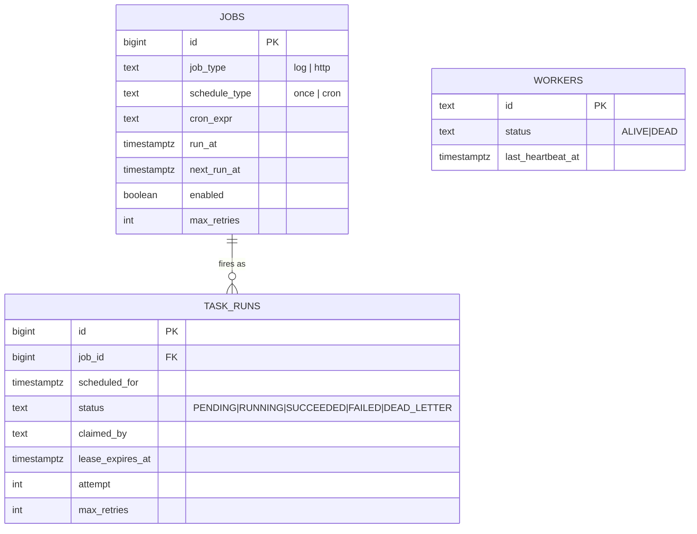

# Architecture

## Contents

- [Data model](#data-model)
- [The atomic claim query](#the-atomic-claim-query)
- [Lease / visibility timeout](#lease--visibility-timeout)
- [Heartbeats and dead-worker detection](#heartbeats-and-dead-worker-detection)
- [Delivery guarantees](#delivery-guarantees)
- [Retry and dead-lettering](#retry-and-dead-lettering)
- [Graceful shutdown](#graceful-shutdown)
- [Trade-offs](#trade-offs)
- [What I'd change in production](#what-id-change-in-production)

## Data model



`jobs` and `task_runs` are deliberately separate concepts. A `job` is a definition — what to
run, and on what schedule. A `task_run` is one concrete firing of it, the thing that actually
gets claimed, executed, retried, and completed. This split is what makes a cron job's history
just a normal accumulation of rows instead of requiring the job itself to somehow represent "I
have fired 47 times, here's the state of each." `workers` is separate from both — it tracks
liveness, not queue state; nothing in the claiming/execution logic requires it to exist for
correctness (see below).

Two unique constraints carry real weight:
- `task_runs (job_id, scheduled_for)` — a given firing can only ever be enqueued once, even if
  the scheduler ticks twice before noticing, or if a second scheduler replica races the first.
- (implicitly) a `task_run`'s `id` plus `claimed_by` is the ownership check every mutation
  (`RenewLease`, `CompleteTask`, `FailTask`) verifies against, so a worker that no longer holds
  the lease can't accidentally complete or fail a task it doesn't own anymore.

## The atomic claim query

```sql
WITH claimable AS (
    SELECT id FROM task_runs
    WHERE (status = 'PENDING' AND scheduled_for <= $3)
       OR (status = 'RUNNING' AND lease_expires_at < $3)
    ORDER BY scheduled_for
    FOR UPDATE SKIP LOCKED
    LIMIT 1
)
UPDATE task_runs
SET status = 'RUNNING', claimed_by = $1, lease_expires_at = $2, attempt = attempt + 1
FROM claimable
WHERE task_runs.id = claimable.id
RETURNING task_runs.*;
```

Walking through why this is airtight under concurrency:

1. **The `SELECT ... FOR UPDATE` inside the CTE locks the row it's about to hand off**, within
   the same transaction as the `UPDATE` that follows. Nothing else can modify that row until this
   transaction commits.
2. **`SKIP LOCKED` is what makes this scale instead of serialize.** Without it, a second
   concurrent transaction hitting this same query would *block*, waiting for the first
   transaction's lock to release, then see the row already updated to `RUNNING` and (correctly,
   but slowly) move on. With `SKIP LOCKED`, the second transaction doesn't wait at all — it
   simply doesn't consider rows currently locked by someone else, and immediately finds a
   *different* claimable row (or `LIMIT 1` returns nothing, if there isn't one). N workers
   claiming simultaneously each get a distinct row in roughly the time of one query, not N times
   that.
3. **The one-row selection and the update happen in a single statement.** There's no
   read-then-write gap for a second query to interleave into — by the time any other transaction
   could observe this row, it's already `RUNNING` with a new `claimed_by`.
4. **The same query handles both "new work" and "recovered work."** The `OR (status = 'RUNNING'
   AND lease_expires_at < $3)` branch means a task whose previous holder's lease expired is
   claimable through the exact same code path as a brand-new task — recovery isn't a special
   case bolted on afterward, it falls out of the query's WHERE clause for free.

`TestClaimNext_ConcurrentWorkers_ExactlyOnce` (40 goroutines, 300 task runs, run with `-race`)
is the proof, not just the argument.

## Lease / visibility timeout

Claiming sets `lease_expires_at = now + lease_duration` (a Go-computed timestamp, passed as a
parameter — not SQL `now()`; see the clock-skew note in the README's engineering notes). While a
worker is actively executing a task, a background goroutine renews that lease at half the lease
duration, so a task that's still legitimately being worked on never has its lease expire out
from under it. If the worker process dies — killed, crashed, network partitioned — nothing
renews the lease, it expires, and the claim query's second branch picks the task back up. The
task's `attempt` counter increments on every claim (including reclaims), which is also what
retry/backoff and dead-lettering key off — a crash-recovered task and a failed-and-retried task
are the same mechanism from the store's point of view.

## Heartbeats and dead-worker detection

Independent of any specific task, every worker periodically upserts its own row in `workers`
with `last_heartbeat_at = now`. The scheduler's reaper marks a worker `DEAD` once its heartbeat
goes stale past a threshold, and — as a belt-and-suspenders optimization — immediately
force-expires the lease on anything that worker was holding, so the task is reclaimable at once
rather than waiting out the full (possibly much longer) natural lease duration. This is
explicitly *not* the primary correctness mechanism: per-task lease expiry, on its own, already
guarantees recovery even if the reaper never ran at all. The heartbeat/reaper layer exists for
operational visibility (which workers are alive, right now) and to shrink the recovery window,
not to provide a guarantee the lease mechanism doesn't already provide on its own.

## Delivery guarantees

taskorbit provides **at-least-once execution**: a task_run will be executed by *some* worker
eventually, possibly more than once if a worker crashes after doing the real work but before the
`CompleteTask` call lands. It does not provide exactly-once execution of the underlying
side effect — that's a property of the job's own idempotency, not something a scheduler can
guarantee on a job's behalf without knowing what the job does. `HTTPExecutor` sends an
`Idempotency-Key` derived from the task run ID on every call specifically so a well-behaved
downstream endpoint *can* dedupe a retried delivery, the same idempotency contract this author's
other portfolio projects (see `meterflow`) implement on the receiving end.

## Retry and dead-lettering

On failure, `FailTask` checks `attempt >= max_retries`: if attempts remain, the task returns to
`PENDING` with `scheduled_for` pushed out by an exponential backoff delay (`internal/backoff`,
capped), ready for anyone to claim again once that time arrives. Once exhausted, it moves to
`DEAD_LETTER` and stays there — no further claim query ever selects a `DEAD_LETTER` row, since
the claim query only looks at `PENDING`/`RUNNING`. This is a normal terminal state a human or a
separate process can inspect via `GET /jobs/{id}/runs`, not an error state the system tries to
recover from automatically.

## Graceful shutdown

On `SIGTERM`/`SIGINT`, the worker's claim loops stop picking up *new* tasks on the next poll
tick, but any task already claimed keeps running to completion — its execution context is
deliberately not derived from the shutdown signal, so an in-flight HTTP call or log write isn't
aborted mid-way. It's still bounded by the lease duration as a safety timeout, so a hung
execution can't block shutdown forever. Once the in-flight task's result (success or failure) is
recorded, the worker process exits.

## Trade-offs

- **Postgres as the queue, not a separate broker.** Using the same database for durable job
  definitions and the claimable queue means one fewer moving part to operate and one fewer place
  consistency can go wrong (no dual-write between "job store" and "queue"). The cost is real:
  every claim is a write transaction against the same database serving the rest of the app's
  reads, and at high enough throughput, row-lock contention on hot rows becomes the limiting
  factor before a dedicated broker would.
- **Attempt count is the retry AND recovery counter.** A crash-recovered claim and a
  failed-then-retried claim both increment the same `attempt` field. This is a deliberate
  simplification — a crash isn't "the job's fault," so conflating it with a real failure could
  be seen as unfair to `max_retries` — but it keeps the model to one counter instead of two, and
  in practice a job that crashes its worker repeatedly is exactly the kind of thing that should
  eventually dead-letter too.
- **The reaper's dead-worker detection is periodic, not push-based.** A worker is only noticed
  as dead on the scheduler's next reap tick, not the instant it actually stops. This is fine
  because it's not the mechanism task recovery actually depends on (lease expiry is) — it only
  affects how quickly the *optimization* kicks in.

## What I'd change in production

- **Move to a dedicated broker once Postgres contention shows up in profiling, not before.**
  Kafka or RabbitMQ solve a different problem (very high throughput, fan-out to many consumers,
  ordering guarantees across partitions) at the cost of a second system to run, a second
  consistency model to reason about, and — for RabbitMQ especially — weaker native support for
  "exactly this row, right now, atomically" than a single `FOR UPDATE SKIP LOCKED` query gives
  for free. For the throughput a single well-tuned Postgres instance handles, the operational
  simplicity of "it's all just Postgres" is worth more than headroom this project doesn't need
  yet. The concrete signal to switch: claim-query latency or lock contention becoming the
  bottleneck under real load, not a hypothetical future scale.
- **Partition or shard `task_runs` once its history grows large.** Completed/dead-lettered rows
  accumulate forever right now; a production system would archive or partition by time so the
  claimable-row index stays small and fast regardless of how much history has piled up.
- **Distributed tracing across scheduler → worker → downstream HTTP call.** Correlation IDs here
  are per-HTTP-request on the API only; a task claimed and executed by a worker doesn't currently
  carry a trace ID linking it back to whatever created the job. OpenTelemetry spans propagated
  through the task_run's metadata would close that gap.
- **A real secrets/config story for HTTP job payloads.** Right now an HTTP job's URL and body
  are stored as plain JSONB — fine for a demo, but a production system running arbitrary
  outbound calls on behalf of users would need payload validation against SSRF (no calling
  internal/metadata IPs) and a way to reference secrets without storing them in the job payload
  itself.
