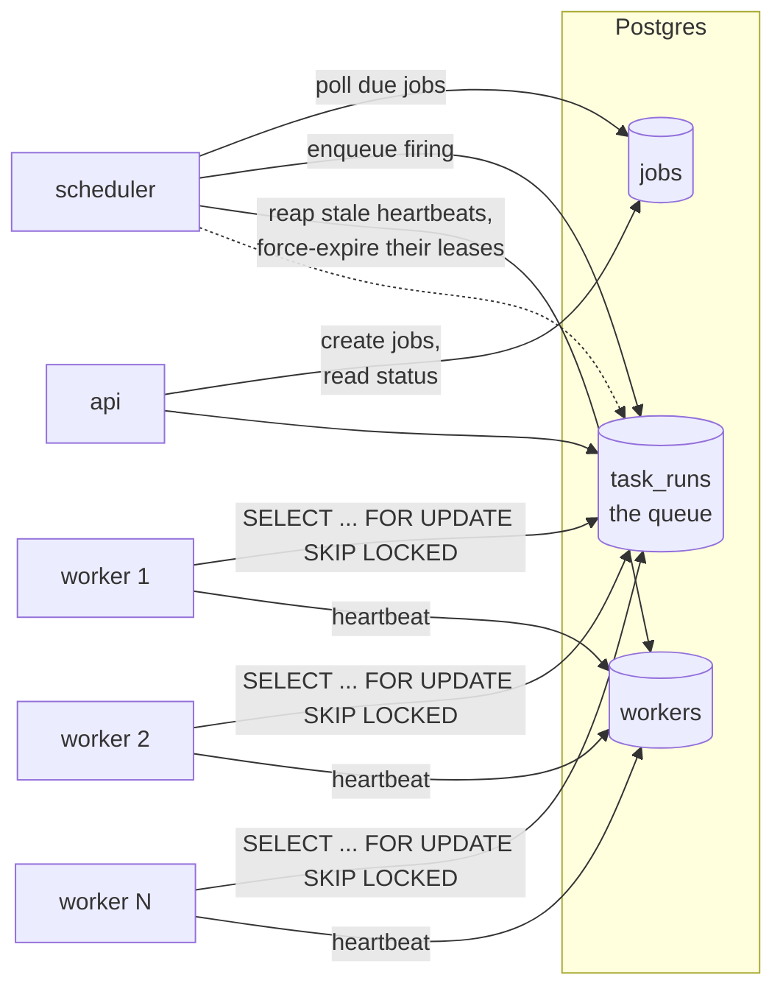

# taskorbit

A distributed job scheduler in Go: one-off and cron-style scheduling, a pool of workers
claiming from a shared queue, guaranteed execution despite worker crashes, and visibility into
every task's status. Built as a portfolio project to demonstrate distributed-systems and
concurrency competence — the domain (run this thing later, run this other thing every hour) is
deliberately simple so all the engineering attention goes into correctness under concurrency
and failure, not the scheduling API surface.

## Why this exists

The easy 80% of a job scheduler is "store some jobs, run them when due." The hard 20% — the
part this project is actually about — is: what happens when two workers both reach for the same
job at the same instant? What happens when a worker claims a job and then the process is
killed? Those aren't edge cases in a real fleet of workers, they're Tuesday. This project answers
both with real tests that create the failure, not just code that looks like it should handle it.

## Architecture



`jobs` is *what and when* (a definition); `task_runs` is *the queue* — one row per actual
firing, claimed and executed by workers. A cron job accumulates many task_runs over its life;
a one-off job gets exactly one. Full technical deep-dive — the claim query, the lease/heartbeat
mechanism, data model, and trade-offs — is in [ARCHITECTURE.md](ARCHITECTURE.md).

## How atomic claiming works, in plain language

Every worker runs the same claim query on a timer. Stripped down, it's:

```sql
SELECT id FROM task_runs
WHERE (status = 'PENDING' AND scheduled_for <= now())
   OR (status = 'RUNNING' AND lease_expires_at < now())
ORDER BY scheduled_for
FOR UPDATE SKIP LOCKED
LIMIT 1
```

`FOR UPDATE` says "I intend to change this row, lock it." `SKIP LOCKED` is the key part: if a
row is already locked by another transaction (another worker's claim, still in flight), *skip
it and look at the next one* instead of waiting. Combined with `LIMIT 1`, N workers running this
at the exact same instant each walk away with a *different* row — none of them wait on each
other, and none of them can ever see the same row as the "winner." That's the whole guarantee:
Postgres's row locking does the mutual exclusion, not any coordination code in this project.

## Leases and heartbeats

Claiming a task doesn't mark it "done" — it marks it `RUNNING` with a `lease_expires_at` a short
time in the future (a "visibility timeout": nobody else can see this task as claimable while the
lease holds). The worker renews that lease periodically while it's still working. If the worker
dies, it stops renewing, the lease eventually expires, and the *very same claim query above*
picks the task back up automatically — the `OR (status = 'RUNNING' AND lease_expires_at < now())`
clause. Recovery isn't a separate code path; it's the same atomic claim, and that's deliberate
(see [ARCHITECTURE.md](ARCHITECTURE.md) for why that matters). Separately, every worker sends a
heartbeat to a `workers` table; the scheduler marks a worker dead if its heartbeat goes stale and
force-expires anything it was holding, as a faster-than-waiting-out-the-lease safety net.

## Tech stack

| Concern | Choice |
|---|---|
| Language | Go 1.23+ |
| Persistence & queue | PostgreSQL 16 (`pgx/v5`), `SELECT ... FOR UPDATE SKIP LOCKED` |
| Migrations | Embedded SQL, tracked in a `schema_migrations` table (no external CLI) |
| API | `net/http` with Go 1.22+ ServeMux method/path routing — no router dependency |
| Observability | `log/slog` with correlation IDs, Prometheus metrics, health/readiness endpoints |
| Testing | Standard `testing`, Testcontainers (Postgres), `-race` throughout |

## Quickstart

Requires Docker Desktop (or another Docker Engine + Compose v2).

```bash
cd infra
docker compose up -d --build
```

This starts Postgres, the scheduler, two workers, and the API. Then seed some example jobs:

```bash
./scripts/seed.sh
```

- **API**: http://localhost:8080 (`GET /jobs`, `POST /jobs`, `GET /jobs/{id}/runs`)
- **Metrics**: http://localhost:8080/metrics
- **Health**: http://localhost:8080/healthz, http://localhost:8080/readyz

No paid API keys are required anywhere — everything runs locally.

## Running the tests

```bash
go vet ./...
go test -race ./...          # needs Docker running, for the Testcontainers tests
golangci-lint run ./...
```

The concurrency and failure tests are the ones worth reading first:

- `internal/store` — `TestClaimNext_ConcurrentWorkers_ExactlyOnce`: 40 goroutines racing to
  claim 300 task runs, every one claimed by exactly one goroutine.
- `internal/store` — `TestClaimNext_ReclaimsExpiredLease`: a lease that's never renewed becomes
  claimable again, with the attempt count incremented.
- `internal/worker` — `TestWorker_RecoversTaskFromCrashedWorker`: a simulated crashed worker's
  task is picked up and completed by a healthy one, with the job's actual work proven (via a
  counting executor) to have run exactly once.

## Engineering notes

- **A real cross-clock-domain bug, caught by a test, not a review.** The dead-worker reaper
  originally force-expired a stale worker's lease using SQL `now()`, while the claim query's
  comparison uses a timestamp computed in Go. Any clock skew between the app process and the
  database — plausible, not exotic, especially across containers — could make the force-expire
  silently ineffective. Fixed by using one consistent, Go-computed timestamp everywhere a lease
  decision is made or written.
- **A flaky test told the truth about wall-clock math.** An early cron-scheduling test computed
  a firing time as `now - 90s`, truncated to the minute, and asserted a *second* scheduler tick
  wouldn't re-fire it. Depending on exactly when in the current minute the test happened to run,
  the truncated math could land the job's next run in the past relative to the second tick —
  an intermittent, timing-dependent failure, not a flaky test to retry past. Fixed by deriving
  the firing time so the next run is provably in the future regardless of wall-clock timing.
- **Local environment quirk, not a code issue: a Windows Application Control policy
  intermittently blocks freshly built/installed executables from running** — both a `go test
  -race` compiled test binary for one package, and the locally installed `golangci-lint.exe`.
  In both cases, `go vet`, a plain `go test`, and an explicitly pre-built race binary confirmed
  the code itself was correct and race-clean; `golangci-lint` was run via `go run
  .../golangci-lint@latest` to sidestep the blocked binary entirely. GitHub Actions' Linux
  runner doesn't have this policy and isn't affected.

## License

MIT — see [LICENSE](LICENSE).
